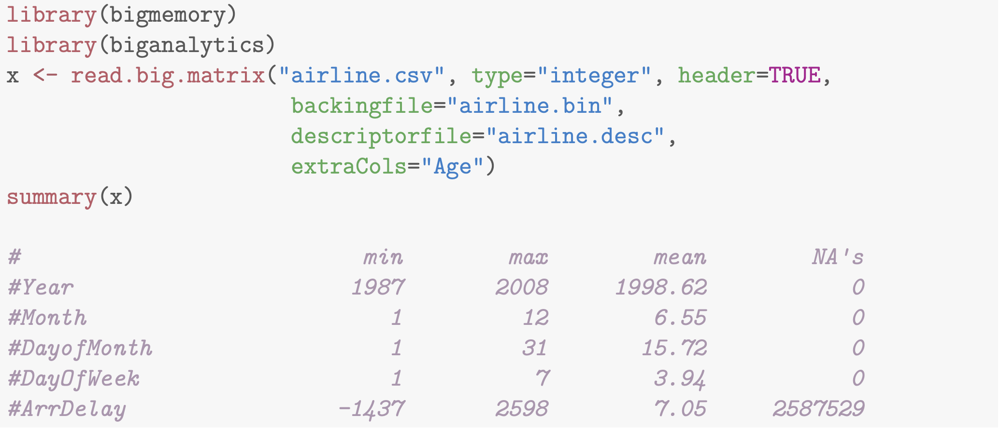

# Prerequisites

## Packages

```{r, message=FALSE, warning=FALSE}
library(tidyverse)
library(purrr) # functional programming
library(future) # allows parallizing
library(furrr) # purrr + future
library(tictoc) # compute processing time
library(bigmemory) # to load large datasets into R
library(biganalytics) # to analyze large datasets
```

# Functional Programming

## Functions

In R, you can write functions! They can make your code easier to understand, speed-up reoccurring tasks and help you to avoid making mistakes. However, writing good functions is a lifetime journey.

Guiding principle: Consider writing a function whenever you’ve copied and pasted a block of code more than twice.

## Functions: A simple example

Let's say we want to compute the standard error of the mean for the duration of eruptions in the `faithful` dataset defined as 

$\sqrt{\mathrm{var}(x)/n}$ 

```{r}
var(faithful$eruptions) # variance
length(faithful$eruptions) #sample size
sqrt(var(faithful$eruptions)/length(faithful$eruptions))
```

## Functions: A simple example

Let's suppose we also want to compute the standard error for the waiting time to the next eruption:

```{r}
sqrt(var(faithful$waiting)/length(faithful$waiting))
```

We basically copy the same code and just replace the variable.

## Functions: A simple example

Let's create a function:

```{r}
standard_error <- function(x) {
    sqrt(var(x)/length(x))
}

standard_error(faithful$eruptions)
standard_error(faithful$waiting)
```

## Key steps in creating functions

1.  Pick a __name__ for the function. 

1.  List the inputs, or __arguments__, to the function inside `function`.
    A function with just one argument would look like `function(x)`.

1.  Place the code you have developed in __body__ of the function, a 
    `{` block that immediately follows `function(...)`.

Always start with working code and turn it into a function; it's harder to create a function and then try to make it work.

## Things to keep in mind when creating functions

- Function names should be verbs, and arguments should be nouns
- Make your code as consistent as possible, functions from the same family should have the same prefix (like `str_` from `stringr`)
- Use comments to explain the "why" of your code
- Common argument names:

    + x, y, z: vectors.
    + w: a vector of weights.
    + df: a data frame.
    + i, j: numeric indices (typically rows and columns).
    + n: length, or number of rows.
    + p: number of columns.

## Excercise

Take 10 minutes to turn a chunk of code that you have used repeatedly couple of weeks into a function. 

## Iterations

Besides functions, you can also use iterations to reduce duplication in your code by repeating the same operation on different columns, or on different datasets.

There are two paradigms of iterations in R: 

1. Imperative programming (for and while loops)

2. Functional programming

## For loops

Let's create a simple tibble

```{r}
df <- tibble(
  a = rnorm(10),
  b = rnorm(10),
  c = rnorm(10)
)
```

## For loops

and compute the median for each column

```{r}
median(df$a)
median(df$b)
median(df$c)
```

## For loops

Instead of copy and pasting we could use a for loop:

```{r}
output <- vector("double", ncol(df))  # 1. output
for (i in seq_along(df)) {            # 2. sequence
  output[[i]] <- median(df[[i]])      # 3. body
}
output
```

## For loops

For loop generally have three components:

1.  The __output__: `output <- vector("double", length(x))`. 
    Before you start the loop, you must always allocate sufficient space 
    for the output. 

1.  The __sequence__: `i in seq_along(df)`. This determines what to loop over: each run of the for loop will assign `i` to a different value from 
    `seq_along(df)`. `seq_along()`is a safe version of the familiar `1:length(l)`. If you have a zero-length vector, `seq_along()` does the right thing:
    
1.  The __body__: `output[[i]] <- median(df[[i]])`. This is the code that does the work. It's run repeatedly, each time with a different value for `i`. 

## Looping patterns

There are three basic ways to loop over a vector. 

1. Looping over numeric indices with `for (i in seq_along(xs))`, and extracting the value with `x[[i]]`.

1.  Looping over elements: `for (x in xs)`. This is useful when it's difficult to save the output efficiently, like when  plotting or saving a file.

1.  Looping over names: `for (nm in names(xs))`. This gives you a name, which you can use to access the value with `x[[nm]]`. This is useful if you want to use the name in a plot title or a file name. 

## Functional programming

R is a functional programming language. This means that it’s possible to wrap up for loops in a function, and call that function instead of using the for loop directly.

## Functional programming

Take our previous small data example:

```{r}
df <- tibble(
  a = rnorm(10),
  b = rnorm(10),
  c = rnorm(10)
)
```

## Functional programming

Now we want to compute the mean of every column. You could do that with a for loop:

```{r}
output <- vector("double", length(df))
for (i in seq_along(df)) {
  output[[i]] <- mean(df[[i]])
}
output
```

## Functional programming

If wewant to compute the means of every column frequently, we can extract it out into a function:

```{r}
col_mean <- function(df) {
  output <- vector("double", length(df))
  for (i in seq_along(df)) {
    output[i] <- mean(df[[i]])
  }
  output
}
```

## Functional programming

If we want to also compute the median and the standard deviation, we could copy and paste the `col_mean()` function and replace the `mean()` with `median()` and `sd()`:

```{r}
col_median <- function(df) {
  output <- vector("double", length(df))
  for (i in seq_along(df)) {
    output[i] <- median(df[[i]])
  }
  output
}
```

## Functional programming

```{r}
col_sd <- function(df) {
  output <- vector("double", length(df))
  for (i in seq_along(df)) {
    output[i] <- sd(df[[i]])
  }
  output
}
```

But now we broke our rule and copied-and-pasted the code twice.

## Functional programming

Let's generalize it instead by adding another argument `fun`to the function thereby passing a function to another function.

```{r}
col_summary <- function(df, fun) {
  out <- vector("double", length(df))
  for (i in seq_along(df)) {
    out[i] <- fun(df[[i]])
  }
  out
}
col_summary(df, mean)
```

## Purrr

The `purrr` package  provides functions that eliminate the need for many common for loops. The apply family of functions in base R (`apply()`, `lapply()`, `tapply()`, etc) solve a similar problem, but purrr is more consistent and thus is easier to learn.

## Purrr

There are a number of core purrr functions,one function for each type of output:

* `map()`     makes a list.
* `map_lgl()` makes a logical vector.
* `map_int()` makes an integer vector.
* `map_dbl()` makes a double vector.
* `map_chr()` makes a character vector.

Each function takes a vector as input, applies a function to each piece, and then returns a new vector that's the same length (and has the same names) as the input. The type of the vector is determined by the suffix to the map function. 

## Purrr

Let's return to our previous for loop. Our return output is a double, so we need `map_dbl()`:

```{r}
map_dbl(df, mean)
map_dbl(df, median)
```

## Purrr

We can even use the `map_` functions in a pipe:

```{r}
df %>% map_dbl(mean)
df %>% map_dbl(median)
```

## Purrr

The `map_` functions have additional features:

*   All purrr functions are implemented in C. This makes them a little faster
    at the expense of readability.
    
    
*   `map_*()` uses ... ([dot dot dot]) to pass along additional arguments 
    to `.f` each time it's called:

    ```{r}
    map_dbl(df, mean, trim = 0.5)
    ```

## Exercise

Take 10 minutes and write code that uses one of the map functions to:

    1. Compute the mean of every column in `mtcars`.
    1. Determine the type of each column in 
    `nycflights13::flights`.

## Exercise solution
\scriptsize

```{r}
    map_dbl(mtcars, mean)
```

```{r}
    map_chr(nycflights13::flights, typeof)
```

\normalsize

## Mapping over multiple arguments

You can use `map2()` to iterate along multiple related inputs in parallel. 

```{r}
mu <- list(5, 10, -3)
sigma <- list(1, 5, 10)
map2(mu, sigma, rnorm, n = 5) %>% str()
```

Use `pmap()` for more than two arguments.

## walk()

`walk` is an alternative to `map` when you want to call a function for its side effects, rather than for its return value. You typically do this because you want to render output to the screen or save files to disk - the important thing is the action, not the return value. Here's a very simple example:

```{r}
x <- list(1, "a", 3)
x %>% 
  walk(print)
```

## Dealing with failure

When you use the map functions to repeat many operations, the chances are much higher that one of those operations will fail. When this happens, you’ll get an error message, and no output.

Purrr provides two functions to deal with failure: `safely` and `possibly

## safely()

`safely()` takes a function and returns a modified version that will never throw an error. Instead, it always returns a list with two elements:

1. `result` is the original result. If there was an error, this will be `NULL`.

1. `error` is an error object. If the operation was successful, this will be `NULL`.

## safely()

Let's illustrate this with a simple example: `log()`:

\scriptsize

```{r}
safe_log <- safely(log)
str(safe_log(10))
str(safe_log("a"))
```

## safely()
\scriptsize

`safely()` is designed to work with map:

```{r}
x <- list(1, 10, "a")
y <- x %>% map(safely(log))
str(y)
```
\normalsize

## possibly()

Like `safely()`, `possibly()` always succeeds. It's simpler than `safely()`, because you give it a default value to return when there is an error. 
    
```{r}
    x <- list(1, 10, "a")
    x %>% map_dbl(possibly(log, NA_real_))
```

# Big Data

## Problems with big data

R has two major limitations:

1. Regardless of the number of CPUs, R will only use 1 on a default build.

1. R reads data into memory by default. The OS can only access ${2^{32}}/{1024^{2}} = 4GB$ of memory on a 32 bit system, but R will break at 2GB.

## Solutions to big data

1. Buy more RAM

1. Use a database

1. Sample, resample, or use Monte Carlo method

1. Let smartly designed packages help you

    + future
    + bigmemory

## Working in parralel

The `future` package provides a simple but yet powerful construct for parallel processing in R.

The future package implements the following types of futures:

\scriptsize

| Name            | OSes        | Description
|:----------------|:------------|:-----------------------------------------------------
| _synchronous:_  |             | _non-parallel:_
| `sequential`    | all         | sequentially and in the current R process
| `transparent`   | all         | as sequential w/ early signaling and w/out local (for debugging)
| _asynchronous:_ |             | _parallel_:
| `multiprocess`  | all         | multicore, if supported, otherwise multisession
| `multisession`  | all         | background R sessions (on current machine)
| `multicore`     | not Windows | forked R processes (on current machine)
| `cluster`       | all         | external R sessions on current, local, and/or remote machines
| `remote`        | all         | Simple access to remote R sessions

\normalsize

## Furrr package
The `furrr` package combines `purrr`'s family of mapping functions and
`future`'s parallel processing capabilities. 

Furrr replaces the `map_*()` functions with a new set of `future_map_*()` functions.

## Furrr

You set a "plan" for how the code should run. The easiest is `multiprocess`. On Mac this picks plan(multicore) and on Windows this picks plan(multisession)

```{r}
plan(multiprocess)
future_map(c("hello", "world"), ~.x)
```

## Furrr

If you are still skeptical, here is some proof that we are running in parallel.

\scriptsize

```{r, eval=FALSE}
library(tictoc)
# This should take 6 seconds in total running sequentially
plan(sequential)
tic()
nothingness <- future_map(c(2, 2, 2), ~Sys.sleep(.x))
toc()
#> 6.053 sec elapsed
```

```{r, eval=FALSE}
# This should take ~2 seconds running in parallel, with a little overhead
plan(multiprocess)
tic()
nothingness <- future_map(c(2, 2, 2), ~Sys.sleep(.x))
toc()
#> 2.242 sec elapsed
```

\normalsize

## Furrr progress bar

For `multiprocess`, `multicore`, and `multisession` plans, you can activate a progress bar for your long running task with `.progress = TRUE`.

## Bigmemory

To load datasets larger than 2GB into R, the ideal solution is to use the  `bigmemory`package along with it's sister package `biganalytics`.

bigmemory uses several matrix objects, most importantly `big.matrix`.

`big.matrix` is an R object that uses a pointer to a C++ data structure. The location of the pointer to the C++ matrix can be saved to the disk or RAM and shared with other users in different sessions.

By loading the pointer object, users can access the data set without reading the entire set into R.

## Bigmemory example
The dataset `airline.csv`, is approximately 11 GB (about 120 million
rows and 29 columns). The `read.big.matrix()` call creates the binary file-backing airline.bin associated with the big.matrix object x. Subsequent R sessions can attach instantly to airline.bin

```{r, out.width = "250px", echo = F, fig.align='center'}

```  

# Homework Exercises

## Homework Exercises
No Homework this week.


##  {.standout}
That's it for today. Questions?    

