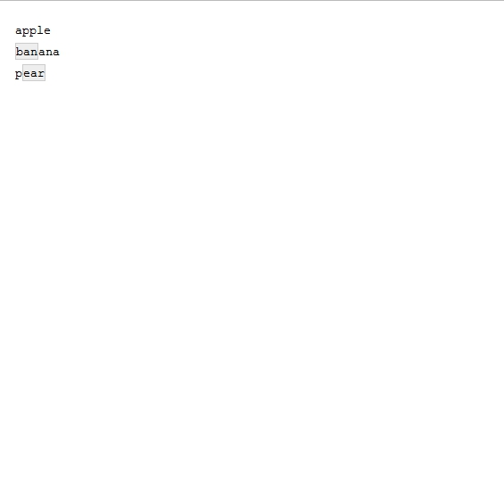
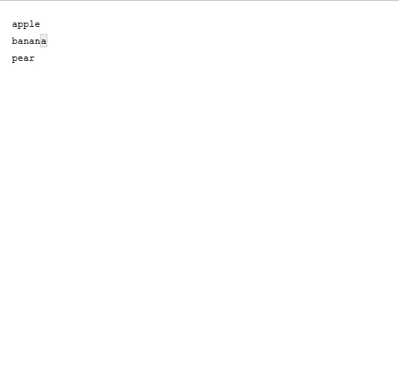

# Last Week's Homework

## Packages
```{r, message = FALSE, warning = FALSE}
library(DBI)
library(RSQLite)
library(tidyverse)
```

## Data
```{r, message = FALSE, warning = FALSE}
url <- paste0("https://raw.githubusercontent.com/mhaber/",
              "AppliedDataScience/",
              "master/slides/week5/data/")
films <- read_csv(paste0(url, "films.csv"))
people <- read_csv(paste0(url, "people.csv"),
                   col_types = "iccc")
reviews <- read_csv(paste0(url, "reviews.csv"))
roles <- read_csv(paste0(url, "roles.csv"))
```

## Set up the database
```{r, echo=FALSE}
file.remove("films.sqlite")
```

```{r}
con <- dbConnect(SQLite(), dbname = "films.sqlite")
```

## Write tables into the database
```{r}
dbWriteTable(con, "films", films)
dbWriteTable(con, "people", people)
dbWriteTable(con, "reviews", reviews)
dbWriteTable(con, "roles", roles)
dbListTables(con)
```

## title, release year and country for every film
```{r, eval = FALSE}
DBI::dbGetQuery(con, "SELECT title, release_year, country
                FROM films")
```

## different type of film roles
```{r}
DBI::dbGetQuery(con, "SELECT DISTINCT role
                FROM roles")
```

## number of unique languages
```{r}
DBI::dbGetQuery(con, "SELECT COUNT(DISTINCT language)
                FROM films")
```


## number of films released before 2000
```{r}
DBI::dbGetQuery(con, "SELECT COUNT(id)
                FROM films
                WHERE release_year < 2000")
```

## name and birth date of the person born on November 11th, 1974
```{r}
DBI::dbGetQuery(con, "SELECT name, birthdate
                FROM people
                WHERE birthdate = '1974-11-11'")
```

## Spanish language films released after 2000, but before 2010
```{r, eval = FALSE}
DBI::dbGetQuery(con, "SELECT *
                FROM films
                WHERE language = 'Spanish' 
                AND release_year > 2000 
                AND release_year < 2010")
```

## people who are still alive
```{r, eval = FALSE}
DBI::dbGetQuery(con, "SELECT name
                FROM people
                WHERE deathdate IS NULL")
```

## amount grossed by the best performing film between 2000 and 2012
```{r}
DBI::dbGetQuery(con, "SELECT MAX(gross)
                FROM films
                WHERE release_year BETWEEN 2000 AND 2012")
```

## average duration in hours for all films
```{r}
DBI::dbGetQuery(con, "SELECT AVG(duration / 60.0) 
                AS avg_duration_hours
                FROM films")
```


## IMDB score and count of film reviews grouped by IMDB score
```{r, eval = FALSE}
DBI::dbGetQuery(con, "SELECT imdb_score, COUNT(id)
                FROM reviews
                GROUP BY imdb_score")
```

## final task
```{r, eval = FALSE}
DBI::dbGetQuery(con, "SELECT country, 
                AVG(budget) AS avg_budget, 
                AVG(gross) AS avg_gross
                FROM films
                GROUP BY country
                HAVING COUNT(id) > 10
                ORDER BY country
                LIMIT 5")
dbDisconnect(con)
```

# Final project

## Two options: 

Your final project is worth 40% of your grad and will have to be submitted by May 17.

You can choose to do one of two types of projects:

1. Competitive projects: Work on a dataset that I provide on. You will be placed on a common leaderboard on Kaggle.

2. Your own projects: Work on a project topic of your choice.

You can (and are incouraged to) work in groups of up to three for both options.

## Option 1: Kaggle

I will create an inclass machine learning (we will learn how in weeks 8-9) competition on Kaggle and will upload a (challenging) dataset. Your goal will be to apply the skills you've learned in this course to prepare and analyze and data. You will submit your solution directly to Kaggle and will be able to see how it compares with those by other students on a live leaderboard.

The competition will go live on April 24, giving you roughly 3 weeks to submit an answer.

To submit to an InClass competition you need to [create a Kaggle account](https://www.kaggle.com/?login=true).


## Option 2: Your own project: Proposal

You will need to prepare a one-page *project proposal* that says what your project is. This document should contain the following information:

- Who is in the project group?
- A very brief description of the problem you want to address. 
- Why is it interesting? How is it relevant to the class?

The proposal is due on April 2.

## Option 2: Your own project: Status report

Once I approved the proposal, you will need to submit a two-page *intermediate status report* outlining what you have done on the project so far. The report should describe:

- The progress you have made towards your goal.
- Details of your plan for the remaining time until the project is due
- Pointers to literature 

The status report is due on April 23.

## Option 2: Your own project: Final report

The *final report* can be at most six pages and should be structured like a small research paper. Broadly speaking it should contain:

- What problem did you work on? Why is it interesting?
- What are the important ideas you explored?
- What ideas from the class did you use?
- What did you learn?
- Results
- If you had much more time, how would you continue the project?
- BONUS: Create an interactive interface to your data (we will learn how in week 10)

The final report is due on May 17.

# Working with Strings

## Packages

```{r, message=FALSE, warning=FALSE}
library(tidyverse)
library(stringr) #install.packages("stringr")
```

# Strings

## Creating strings

Strings are wrapped in `'` or `"` quotes:

```{r}
string1 <- "This is a string"
string2 <- 'If I want to include a "quote" inside
a string, I use single quotes'
```

You can use `\` to “escape” single or double quotes inside a string:

```{r}
double_quote <- "\"" # or '"'
single_quote <- '\'' # or "'"
```

## Special characters

* `\n	 newline`
* `\r	 carriage return`
* `\t	 tab`
* `\b	 backspace`
* `\a	 alert (bell)`
* `\f	 form feed`
* `\v	 vertical tab`
* `\\	 backslash \`

## Functions for strings

```{r}
# Length
str_length("Data Management with R")
```

```{r}
# Combining strings
str_c("Data Management","with R", sep = " ")
```

## Functions for strings

```{r}
#Subsetting strings
x <- c("Apple", "Banana", "Pear")
str_sub(x, 1, 3)
str_sub(x, -3, -1)
```

## Functions for strings
```{r}
# Changing case
str_to_upper(c("a", "b"))
str_to_lower(c("A", "B"))
```

## Functions for strings
`stringr` has 43 functions to manipulate strings. If you need more, then use `stringi`, which has 232 functions. The main difference between the functions in both packages is the prefix: `str_` vs. `stri_`.


# Regular expressions

## Regular expressions

Regular Expressions (regex) are a language or syntax to search in texts.
Regex are used by most search engines in one form or another and are part of almost any programming language. In R, many string functions in `base` R as well as in `stringr` package use regular expressions, even Rstudio's search and replace allows regular expression.

## Regular expression syntax 

Regular expressions typically specify characters to seek out, possibly with information about repeats and location within the string. This is accomplished with the help of metacharacters that have specific meaning: 

* `$ * + . ? [ ] ^ { } | ( ) \`. 


## String functions related to regular expression

* To identify match to a pattern

    + `grep(..., value = FALSE)`, `grepl()`, `stringr::str_detect()` 
  
* To extract match to a pattern

    + `grep(..., value = TRUE)`, `stringr::str_extract()`, `stringr::str_extract_all()`
  
* To locate pattern within a string

    + `regexpr()`, `gregexpr()`, `stringr::str_locate()`, `stringr::str_locate_all()`
  
* To replace a pattern

    + `sub()`, `gsub()`, `stringr::str_replace()`, `stringr::str_replace_all()`    
  
* To split a string using a pattern

    + `strsplit()`, `stringr::str_split()`
  

## Pattern matching

The simplest patterns match exact strings:

```{r}
x <- c("apple", "banana", "pear")
str_view(x, "an")
```

```{r, echo = FALSE, out.width = "150px"}

```

## Pattern matching

`.` matches any character (except a newline):

```{r}
str_view(x, ".a.")
```

```{r, echo = FALSE, out.width = "150px"}

```


## Position of pattern within the string 

`^` matches the start of the string.   
  
```{r}
x <- c("apple", "banana", "pear")
str_view(x, "^a")
```

```{r, echo = FALSE, out.width = "150px"}

```

## Position of pattern within the string 

`$` matches the end of the string.  
  
```{r}
str_view(x, "a$")
```

```{r, echo = FALSE, out.width = "150px"}

```

`\b` matches the empty string at either edge of a _word_.   
`\B` matches the empty string provided it is not at an edge of a word.  

## Quantifiers

Quantifiers specify the number of repetitions of the pattern.   

  * `*`: matches at least 0 times.   
  * `+`: matches at least 1 times.     
  * `?`: matches at most 1 times.    
  * `{n}`: matches exactly n times.    
  * `{n,}`: matches at least n times.    
  * `{n,m}`: matches between n and m times.     


## Quantifiers

```{r}
strings <- c("a", "ab", "acb", "accb", "acccb", "accccb")
grep("ac*b", strings, value = TRUE)
grep("ac+b", strings, value = TRUE)
grep("ac?b", strings, value = TRUE)
```

## Quantifiers

```{r}
grep("ac{2}b", strings, value = TRUE)
grep("ac{2,}b", strings, value = TRUE)
grep("ac{2,3}b", strings, value = TRUE)
```

  
## More operators
* `\`: suppress the special meaning of metacharacters in regular expression, i.e. `$ * + . ? [ ] ^ { } | ( ) \`, similar to its usage in escape sequences. Since `\` itself needs to be escaped in R, we need to escape these metacharacters with double backslash like `\\$`. 
* `[...]`: a character list, matches any one of the characters inside the square brackets. We can also use `-` inside the brackets to specify a range of characters.   
* `[^...]`: an inverted character list, similar to `[...]`, but matches any characters __except__ those inside the square brackets.  
  

## More operators
* `|`: an "or" operator, matches patterns on either side of the `|`.  
* `(...)`: grouping in regular expressions which allows to retrieve the bits that matched various parts of your regular expression. Each group can than be refer using `\\N`, with N being the No. of `(...)` used. This is called __backreference__.    


## Operators

```{r}
strings <- c("^ab", "ab", "abc", "abd", "abe", "ab 12")
grep("ab[c-e]", strings, value = TRUE)
grep("ab[^c]", strings, value = TRUE)
```

## Operators

```{r}
grep("^ab", strings, value = TRUE)
grep("\\^ab", strings, value = TRUE)
grep("abc|abd", strings, value = TRUE)
gsub("(ab) 12", "\\1 34", strings)
```

## Character classes

Character classes allow to specify entire classes of characters, such as numbers, letters, etc. There are two flavors of character classes, one uses `[:` and `:]` around a predefined name inside square brackets and the other uses `\` and a special character. They are sometimes interchangeable.   

  - `[:digit:]` or `\d`: digits, 0 1 2 3 4 5 6 7 8 9, equivalent to `[0-9]`.  
  - `\D`: non-digits, equivalent to `[^0-9]`.  
  - `[:lower:]`: lower-case letters, equivalent to `[a-z]`.  
  - `[:upper:]`: upper-case letters, equivalent to `[A-Z]`.  
  - `[:alpha:]`: alphabetic characters, equivalent to `[[:lower:][:upper:]]` or `[A-z]`.  
  - `[:alnum:]`: alphanumeric characters, equivalent to `[[:alpha:][:digit:]]` or `[A-z0-9]`.

  
## Character classes

  - `\w`: word characters, equivalent to `[[:alnum:]_]` or `[A-z0-9_]`.  
  - `\W`: not word, equivalent to `[^A-z0-9_]`.  
  - `[:xdigit:]`: hexadecimal digits (base 16), 0 1 2 3 4 5 6 7 8 9 A B C D E F a b c d e f, equivalent to `[0-9A-Fa-f]`.
  - `[:blank:]`: blank characters, i.e. space and tab.  
  - `[:space:]`: space characters: tab, newline, vertical tab, form feed, carriage return, space.
  - `\s`: space, ` `.  
  - `\S`: not space.  
  - `[:punct:]`: punctuation characters, ! " # $ % & ' ( ) - + , - . / : ; < = > ? @ [ \ ] ^ _ ` { | } ~.
  
## Character classes
  
  - `[:graph:]`: graphical (human readable) characters: equivalent to `[[:alnum:][:punct:]]`.
  - `[:print:]`: printable characters, equivalent to `[[:alnum:][:punct:]\\s]`.
  - `[:cntrl:]`: control characters, like `\n` or `\r`, `[\x00-\x1F\x7F]`.  

Note:       

- `[:...:]` has to be used inside square brackets, e.g. `[[:digit:]]`.     
- `\` itself is a special character that needs escape, e.g. `\\d`. Do not confuse these regular expressions with R escape sequences such as `\t`.      


## General modes for patterns

There are different [syntax standards](http://en.wikipedia.org/wiki/Regular_expression#Standards) for regular expressions, and R offers two:

  * POSIX extended regular expressions (default)
  * Perl-like regular expressions.
  
You can easily switch between by specifying `perl = FALSE/TRUE` in `base` R functions, such as `grep()` and `sub()`. For functions in the `stringr` package, wrap the pattern with `perl()`. 

## General modes for patterns

By default, pattern matching is case sensitive in R, but you can turn it off with `ignore.case = TRUE` (base R functions). In `stringr`, you need to pass the `ignore.case = TRUE` inside a modifier function like `str_replace(string, regex(pattern, ignore.case=TRUE))`. Alternatively, you can use `tolower()` and `toupper()` functions to convert everything to lower or upper case. 

## Regular expression vs shell globbing

The term globbing refers to pattern matching based on wildcard characters. A wildcard character can be used to substitute for any other character or characters in a string. Globbing is commonly used for matching file names or paths, and has a much simpler syntax. Below is a list of globbing syntax and their comparisons to regular expression:   

  * `*`: matches any number of unknown characters, same as `.*` in regular expression.  
  * `?`: matches one unknown character, same as `.` in regular expression.  
  * `\`: same as regular expression.  
  * `[...]`: same as regular expression.  
  * `[!...]`: same as `[^...]` in regular expression.   

## Detect matches

To determine if a character vector matches a pattern, use `str_detect()`. It returns a logical vector the same length as the input:

```{r}
x <- c("apple", "banana", "pear")
str_detect(x, "e")
```

## Detect matches

```{r}
# How many common words start with b?
sum(str_detect(words, "^b"))
# What proportion of common words end with a vowel?
mean(str_detect(words, "[aeiou]$"))
```

## Detect matches
A variation on `str_detect()` is `str_count()`: rather than a simple yes or no, it tells you how many matches there are in a string:

```{r}
x <- c("apple", "banana", "pear")
str_count(x, "a")

# On average, how many vowels per word?
mean(str_count(words, "[aeiou]"))
```

## Replace matches

str_replace()` and `str_replace_all()` allow you to replace matches with new strings. The simplest use is to replace a pattern with a fixed string:

```{r}
x <- c("apple", "pear", "banana")
str_replace(x, "[aeiou]", "-")
str_replace_all(x, "[aeiou]", "-")
```

## Replace matches
With `str_replace_all()` you can perform multiple replacements by supplying a named vector:

```{r}
x <- c("1 house", "2 cars", "3 people")
str_replace_all(x, c("1" = "one", "2" = "two", "3" = "three"))
```

## String splitting

Use `str_split()` to split a string up into pieces. 

```{r}
"a|b|c|d" %>% 
  str_split("\\|")
```

## Resources

  - Regular expression in R [official document](https://stat.ethz.ch/R-manual/R-devel/library/base/html/regex.html).  
  - Perl-like regular expression: regular expression in perl [manual](http://perldoc.perl.org/perlre.html#Regular-Expressions).   
  - [`qdapRegex` package](http://trinkerrstuff.wordpress.com/2014/09/27/canned-regular-expressions-qdapregex-0-1-2-on-cran/): a collection of handy regular expression tools, including handling abbreviations, dates, email addresses, hash tags, phone numbers, times, emoticons, and URL etc.   
  - On these websites, you can simply paste your test data and write regular expression, and matches will be highlighted.
  
    + [regexpal](http://regexpal.com/)
    + [RegExr](http://www.regexr.com/)   

Test your skills solving regexp crosswords at https://regexcrossword.com/challenges/beginner.

# Group exercises

## Group exercises

1. Given the corpus of common words in `stringr::words`, create regular expressions that find all words that:
    
    1. Start with "y".
    
    1. End with "x"

    1. Start with a vowel.
    
    1. That only contain consonants.

    1. End with `ed`, but not with `eed`.
    
    1. End with `ing` or `ise`.
    
    1. Start with three consonants.
    
    1. Have three or more vowels in a row.
    
    1. Have two or more vowel-consonant pairs in a row.
    
    1. Contain a repeated pair of letters (e.g. "church" contains "ch" repeated twice.)

<!-- ## Group exercises -->


<!-- 2.  Describe in words what these regular expressions match: -->

<!--     2. `^.*$` -->
<!--     2. `"\\{.+\\}"` -->
<!--     2. `\d{4}-\d{2}-\d{2}` -->
<!--     2. `"\\\\{4}"` -->
<!--     2. `(.)\1\1` -->
<!--     2. `"(.)(.)\\2\\1"` -->


## Group exercises solution

```{r}
#Words starting with y
str_view(stringr::words, "^y")
```

```{r}
#Words ending with x
str_view(stringr::words, "x$")
```

```{r}
#Words starting with vowels
str_view(stringr::words, "^[aeiou]")
```


## Group exercises solution

```{r}
#Words that contain only consonants
str_view(stringr::words, "^[^aeiou]+$", match=TRUE)
```

```{r}
#Words that end with ed but not with eed
str_view(stringr::words, "^ed$|[^e]ed$", match = TRUE)
```

```{r}
#Words ending in ing or ise
str_view(stringr::words, "i(ng|se)$", match = TRUE)
```

## Group exercises solution

```{r}
#All words starting with three consonants
str_view(words, "^[^aeiou]{3}", match = TRUE)
```

```{r}
#Three or more vowels in a row
str_view(words, "[aeiou]{3,}", match = TRUE)
```

```{r}
#Two or more vowel-consonant pairs in a row
str_view(words, "([aeiou][^aeiou]){2,}", match = TRUE)
```

```{r}
#Any two characters repeated
str_view(words, "(..).*\\1", match = TRUE)
```

<!-- ## Group exercises solution -->

<!-- * `^.*$`: Any string -->
<!-- * `"\\{.+\\}"`: Any string with curly braces surrounding at least one character. -->
<!-- * `\d{4}-\d{2}-\d{2}`: A date in “%Y-%m-%d” format: four digits followed by a dash, followed by two digits followed by a dash, followed by another two digits followed by a dash. -->
<!-- * `"\\\\{4}"`: four backslashes -->
<!-- * `(.)\1\1`: The same character apearing three times in a row -->
<!-- * `"(.)(.)\\2\\1"`: A pair of characters followed by the same pair of characters in reversed order -->
    
# Homework Exercises

## Homework Exercises

For this week's homework exersises go to Moodle and answer the Quiz posted in the Working with Strings section.

Also, please fill out the following survey until so that I can improve the course if necessary: https://goo.gl/forms/cyo5svHi4DmLkDWN2

Deadline: Tuesday, March 26.


##  {.standout}
That's it for today. Questions?    

