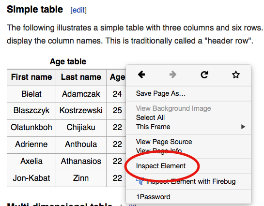
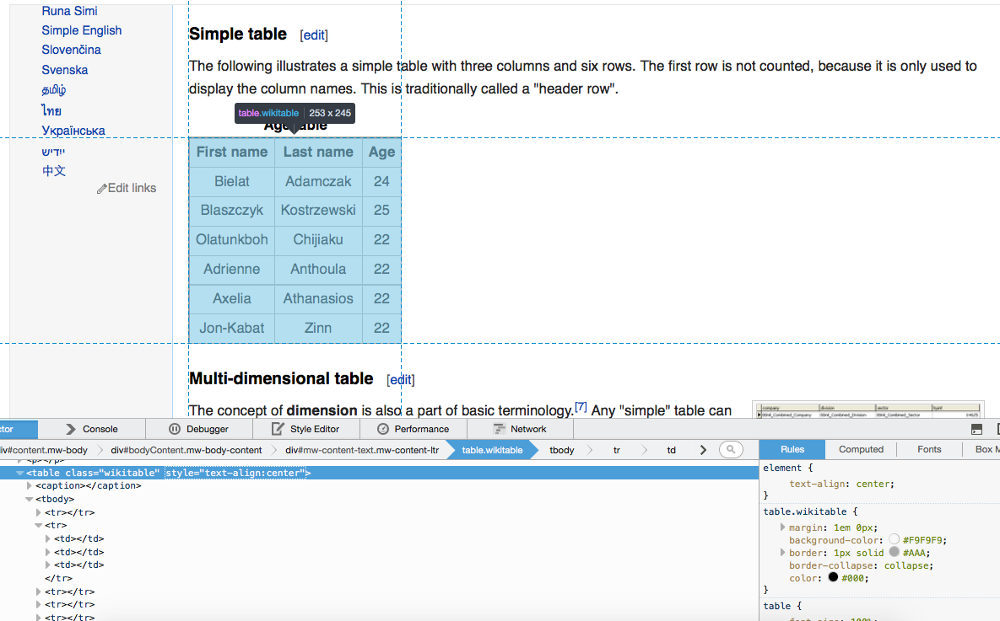

# Prerequisites

## Packages

```{r, message=FALSE, warning=FALSE}
library(tidyverse)
library(stringr) 
library(rvest) #install.packages("rvest")
library(RCurl) #install.packages("RCurl")
library(httr) #install.packages("httr")
library(httpuv) #install.packages("httpuv")
library(rtweet) #install.packages("tweet")
library(RSelenium) #install.packages("RSelenium")
```

# Last week's homework

## Extract name from email

```{r}
email <- c("tom@hogwarts.com",
    "tom.riddle@hogwarts.com",
    "tom@hogwarts.eu.com",
    "potter@hogwarts.com",
    "harry@hogwarts.com",
    "hermione+witch@hogwarts.com")
str_extract(email, "^[\\w\\.\\+]*")
```

## extract image files

\footnotesize
```{r}
files <- c(".bash_profile",
    "workspace.doc",
    "img0912.jpg",
    "updated_img0912.png",
    "documentation.html",
    "favicon.gif",
    "img0912.jpg.tmp",
    "access.lock")
str_extract(files, ".*\\.(jpg|png|gif)$")
```

\normalsize

## Extract line number from log files

\footnotesize
```{r}
log <- c("W/dalvikvm( 1553): threadid=1: uncaught exception",
    "E/( 1553): FATAL EXCEPTION: main",
    "E/( 1553): java.lang.StringIndexOutOfBoundsException",
    "E/( 1553):   at widget.List.makeView(ListView.java:1727)",
    "E/( 1553):   at widget.List.fillDown(ListView.java:652)",
    "E/( 1553):   at widget.List.fillFrom(ListView.java:709)")
str_extract(log, "(?<=java:).+?(?=\\))")
```
\normalsize


## Regex help

[RStudio string cheatsheet](https://github.com/rstudio/cheatsheets/raw/master/strings.pdf)

# Webscraping intro

## Example from my own work

My task was to find out how people talk about the Mercedes-Benz GLS on a forum: [mbworld.org](https://mbworld.org/forums/gls-class-x166-207/?daysprune=-1&order=desc&sort=replycount)

## Browsing vs. scraping

**Browsing**

* you click on something
* browser sends request to server that hosts website
* server returns resource (often an HTML document)
* browser interprets HTML and renders it in a nice fashion

## Browsing vs. scraping

**Scraping with R**

* you manually specify a resource
* R sends request to server that hosts website
* server returns resource
* R parses HTML (i.e., interprets the structure), but does not render it in a nice fashion
* it's up to you to tell R which parts of the structure to focus on and what content to extract

## Online text data sources

- **web pages** (e.g. http://example.com)
- **web formats** (XML, HTML, JSON, ...)
- **web frameworks** (HTTP, URL, APIs, ...)
- **social media** (Twitter, Facebook, LinkedIn, Snapchat, Tumbler, ...)
- **data in the web** (speeches, laws, policy reports, news, ... )
- **web data** (page views, page ranks, IP-addresses, ...)

## Before scraping, do some googling!

- If the resource is well-known, someone else has probably built a tool which solves the problem for you.
- [ropensci](https://ropensci.org/) has a [ton of R packages](https://ropensci.org/packages/) providing easy-to-use interfaces to open data.
- The [Web Technologies and Services CRAN Task View](http://cran.r-project.org/web/views/WebTechnologies.html) is a great overview of various tools for working with data that lives on the web in R.

## What's HTML?

**HyperText Markup Language**

* markup language = plain text + markups
* standard for the construction of websites
* relevance for web scraping: web architecture is important because it determines where and how information is stored

## Inspect the source code in your browser

**Firefox**
1. right click on page
2. select "View Page Source"

**Chrome**
1. right click on page
2. select "View page source"

**Safari**
1. click on "Safari"
2. select "Preferences"
3. go to "Advanced"
4. check "Show Develop menu in menu bar"
5. click on "Develop"
6. select "Show Page Source."


## CSS?

**Cascading Style Sheets**

* style sheet language to give browsers information of how to render HTML documents
* CSS code can be stored within an HTML document or in an external CSS file
* selectors, i.e. patterns used to specify which elements to format in a certain way, can be used to address the elements we want to extract information from
* works via tag name (e.g.,`<h2>`,`<p>`) or element attributes `id` and `class`

## CSS?

**How does it work?**

[CSS Diner]("http://flukeout.github.io/")

## XPath

* XPath is a query language for selecting nodes from an XML-style document (including HTML)
* provides just another way of extracting data from static webpages
* you can also use XPath with R, it can be more powerful than CSS selectors


## Example

```{r, out.width = "300px", echo = F}
knitr::include_graphics("img/wikiTable.png")
```  


## Inspecting elements

```{r, out.width = "220px", echo = F}

```  

## Hover to find desired elements

```{r, out.width = "260px", echo = F}

```  


## `Rvest`

[rvest](https://github.com/hadley/rvest) is a nice R package for web-scraping by (you guessed it) Hadley Wickham.

- see also: https://github.com/hadley/rvest
- convenient package to scrape information from web pages
- builds on other packages, such as xml2 and httr
- provides very intuitive functions to import and process webpages


## Basic workflow of scraping with rvest

\footnotesize
```{r}
# 1. specify URL
"http://en.wikipedia.org/wiki/Table_(information)" %>% 

# 2. download static HTML behind the URL and parse it into an XML file
read_html() %>% 

# 3. extract specific nodes with CSS (or XPath)
html_node(".wikitable") %>%

# 4. extract content from nodes
html_table(fill = TRUE)
```

\normalsize

## Selectorgadget

- [Selectorgadget](http://selectorgadget.com/) is a [Chrome browser extension](https://chrome.google.com/webstore/detail/selectorgadget/mhjhnkcfbdhnjickkkdbjoemdmbfginb?hl=en) for quickly extracting desired parts of an HTML page.

* to learn about it, use vignette("selectorgadget")

* to install it, visit http://selectorgadget.com/

## Selectorgadget

```{r, eval = FALSE}
url <- "http://spiegel.de/schlagzeilen"
css <- ".schlagzeilen-headline"
url_parsed <- read_html(url)
html_nodes(url_parsed, css = css) %>% html_text
```


## Technologies and Packages

- Regular Expressions / String Handling

    + **stringr**, stringi

- HTML / XML / XPAth / CSS Selectors

    + **rvest**, xml2, XML

- JSON

    + **jsonlite**, RJSONIO, rjson

- HTTP / HTTPS

    + **httr**, curl, RCurl

- Javascript / Browser Automation

    + **RSelenium**

- URL

    + **urltools**


# APIs

## Working with APIs

* Application programming interfaces (APIs) allow a direct connection to data hosted on a website
* Most modern APIs use HTTP (HyperText Transfer Protocol) for communication and data transfer between server and client
* R package httr as a good-to-use HTTP client interface
* Most web data APIs return data in JSON or XML format
* R packages jsonlite and xml2 good to process JSON or XML-style data

## Working with APIs

- If you want to tap an existing API, you have to

    + figure out how it works (what requests/actions are possible, what endpoints exist)
    + (register to use the API)
    + formulate queries to the API from within R
    + process the incoming data

## Twitter

**Twitter has two types of APIs**

- REST APIs --> reading/writing/following/etc.

- Streaming APIs --> low latency access to 1% of global stream - public, user and site streams

- authentication via OAuth

- documentation at https://dev.twitter.com/overview/documentation


## Accessing the Twitter APIs

To access the REST and streaming APIs, all you need is a Twitter account and you can be up in running in minutes!

Simply send a request to Twitter’s API (with a function like `search_tweets()`) during an interactive session of R, authorize the embedded `rstats2twitter` app (approve the browser popup), and your token will be created and saved/stored (for future sessions) for you!

You can obtain a developer account to get more stability and permissions.

## Use twitter in R

```{r, eval = FALSE}
library(rtweet)

## search for 1000 tweets using the #niewiedercdu hashtag
tweets <- search_tweets(
  "#nieMehrCDU", n = 1000, include_rts = FALSE
)
```

Find out what else you can do with the `rtweet` package:
<https://github.com/mkearney/rtweet>

# Scraping dynamic pages

## `RSelenium`
To scrape dynamic web pages (e.g. with Java running in the background) use `RSelenium`


# Group excercises

## Breweries in Germany

Fetch a list of cities with breweries in Germany:
http://www.biermap24.de/brauereiliste.php

## CSS Diner

Repeat playing CSS diner and complete all levels!


# Group excercises solution

## Breweries in Germany

```{r}
url <- "http://www.biermap24.de/brauereiliste.php"
content <- read_html(url)
anchors <- html_nodes(content, ".bgcolor7 > table td+ td a")
cities <- html_text(anchors)
cities <- str_trim(cities)
cities <- cities[!str_detect(cities, "\\(\\d+\\)")]
length(unique(cities))
cities <- data.frame(sort(table(cities)))
```


# Homework Exercises

## Homework Exercises
For this week's homework exersises go to Moodle and complete the assignment posted in the Web Scraping section.

Deadline: Tueday, April 2.


##  {.standout}
That's it for today. Questions?    

