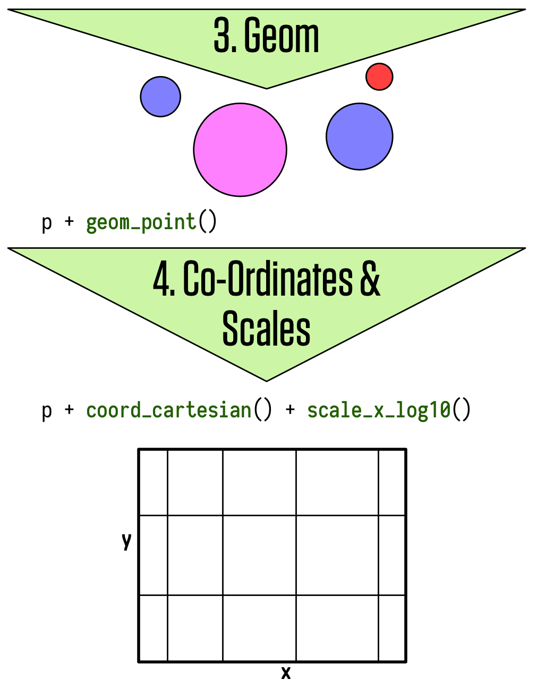

# Last week's homework

## Create lists of urls

\footnotesize
```{r, message= FALSE}
library(rvest)
library(stringr)
parsedURL <- paste0("https://comicvine.gamespot.com/",
"profile/arthurcbps/lists/top-200-heroes-of-marvel/14088/") %>% 
  read_html()

urls <- html_nodes(parsedURL, "a") %>% 
  html_attr("href") %>% 
  str_extract("/.*/\\d{4}-\\d+") %>% 
  .[!is.na(.)] %>% 
  unique()
```

## Loop through URLs and collect info

\scriptsize

```{r, message= FALSE, warning=FALSE}
library(tidyverse)
baseurl <- "https://comicvine.gamespot.com/"
allList <- list()

for(i in 1:21){
heroeHtml <- paste0(baseurl, urls[i]) %>% 
  read_html()
variables <- heroeHtml %>% 
  html_nodes("th") %>% 
  html_text() %>% 
  str_squish() 
bio <- heroeHtml %>% 
  html_nodes(".bar") %>% 
  html_text() %>% 
  str_squish() %>% 
  str_replace_all("n/a", "")
df <- data.frame(variables, bio, stringsAsFactors = FALSE) %>% 
  spread(variables, bio)
allList[[i]] <- df
}
```

## Number of issues appearances

```{r, message= FALSE}
dfAll <- reshape2::melt(allList)

dfAll %>% 
  dplyr::mutate(`Appears in` = as.numeric(
    gsub(" issues", "", `Appears in`))) %>% 
  top_n(1, `Appears in`) %>% 
  select(`Super Name`)
```

## Character Type

```{r, message= FALSE}
dfAll %>% 
  group_by(`Character Type`) %>% 
  summarise(n())
```

## Never died

```{r, message= FALSE}
dfAll %>% 
  filter(Died == "None") %>% 
  count()
```

\normalsize

# Effective Visualization with R

## Packages

```{r, message=FALSE, warning=FALSE}
library(tidyverse)
library(broom) # Tidy Model output
library(extrafont) # Custom fonts package
loadfonts() # Register custom fonts
library(gapminder) # Example GDP dataset
library(hrbrthemes) # Custom theme package
library(margins) # Compute marginal effects
library(MASS) # Statistical models package
library(scales) # Adjust scales
library(stargazer) # Produce beautiful tables
library(survival) # For survival models
```

## Why Visualization is Important

> "At their best, graphics are instruments for reasoning about quantitative information."
[Tufte (1983)](https://books.google.de/books/about/The_Visual_Display_of_Quantitative_Infor.html?id=BHazAAAAIAAJ&redir_esc=y)

> "There is no statistical tool that is as powerful as a well-chosen graph."
[Chambers et al. (1983)](https://books.google.de/books/about/Graphical_methods_for_data_analysis.html?id=I-tQAAAAMAAJ)

> "Diagrams prove nothing, but bring outstanding features readily to the eye."
[Fisher (1925)](https://books.google.de/books/about/Statistical_Methods_For_Research_Workers.html?id=4bTttAJR5kEC&redir_esc=y)

> "Graphics should report the results of careful data analysis—rather than be an
attempt to replace it." [Tukey (1993)](https://www.jstor.org/stable/1390951?seq=1#page_scan_tab_contents)

## Goals

- Discovery goals:

    + Giving an overview—a qualitative sense of what is in a dataset
    + Conveying the sense of the scale and complexity of a dataset

- Communication goals:

    + Communication to self and others: Displaying information from the dataset in a readily understandable way
    + Telling a story
    + Attracting attention and stimulating interest

## Interpreting a graph depends on expectations

- If readers have a lot of background knowledge, they will view the graphic differently 
don't assume you already have the reader’s interest and involvement 
- Making graphics attractive can help motivate readers to understand them

## Graphics are part of a story

- A graphic does not live on its own
- There can be annotations, a legend, a title, a caption, accompanying text, an overall story, and a headline

## Seven Rules for Better Figures ([Rougier et al. 2014](http://journals.plos.org/ploscompbiol/article?id=10.1371/journal.pcbi.1003833))

1. Know your audience

    + Who is the figure for?
2. Identify your message

    + What is the role of the figure?
3. Captions are not optional

    + Always use captions, explaining how to read a figure
4. Use color effectively

    + Color can be your greatest ally or your worst enemy ([Tufte 1983](https://books.google.de/books/about/The_Visual_Display_of_Quantitative_Infor.html?id=BHazAAAAIAAJ&redir_esc=y))
    
## Seven Rules for Better Figures ([Rougier et al. 2014](http://journals.plos.org/ploscompbiol/article?id=10.1371/journal.pcbi.1003833))

5. Do not mislead the reader

    + A scientific figure is tied to the data
6. Avoid chartjunk

    + Get rid of any unnecessary non-data-ink
7. Get the right tool

    + Use R!


## ggplot2

R has several systems for making graphs, but `ggplot2` is one of the most elegant and most versatile. `ggplot2` implements the grammar of graphics, a coherent system for describing and building graphs.

## ggplot2 examples

```{r, out.width = "300px", echo = F, fig.align='center'}
knitr::include_graphics("img/weather.png")
```  

[Source](http://rpubs.com/bradleyboehmke/weather_graphic)

## ggplot2 examples

```{r, out.width = "300px", echo = F, fig.align='center'}
knitr::include_graphics("img/vaccination.png")
```  

[Source](https://benjaminlmoore.wordpress.com/2015/04/09/recreating-the-vaccination-heatmaps-in-r/)

## ggplot2 examples

```{r, out.width = "300px", echo = F, fig.align='center'}
knitr::include_graphics("img/aircraft.png")
``` 

[Source](https://www.quora.com/What-is-the-most-elegant-plot-you-have-made-using-ggplot2-in-R-Embed-the-code-if-possible)

## ggplot2 examples

```{r, out.width = "300px", echo = F, fig.align='center'}
knitr::include_graphics("img/map.png")
``` 

[Source](https://github.com/hrbrmstr/ggcounty)

## The grammar of graphics
- Each plot is made of layers. Layers include the coordinate system (x-y), points, labels, etc.
- Each layer has aesthetics (`aes`) including x & y, size, shape, and color.
- The main layer types are called geometrics(`geom`) and include
lines, points, etc.

## The grammar of graphics

A `ggplot` is build piece by piece

```{r, out.width = "300px", echo = F, fig.align='center'}
knitr::include_graphics("img/ggplot1.png")
``` 

[Source](http://socviz.co/make-a-plot.html#make-a-plot)

## The grammar of graphics

```{r, out.width = "300px", echo = F, fig.align='center'}

``` 

## The grammar of graphics

```{r, out.width = "300px", echo = F, fig.align='center'}
knitr::include_graphics("img/ggplot3.png")
``` 

## ggplot workflow

1. Tell the `ggplot()` function what your data are.

2. Tell `ggplot` what relationships we want to see.

3. Tell `ggplot` how you want to see the relationships in your data.

4. Add additional layers to the p object one at a time.

5. Use additional functions to adjust scales, labels, tick marks.

## Components of a ggplot2 graph

- \alert{data:} Variables mapped to aesthetic attributes
- \alert{aesthetic}: Visual property of the plot objects
- \alert{geom:} Geometrical object used to represent data
- \alert{stats:} Statistical transformations of the data
- \alert{scales:} Values mapped to aesthetic attributes
- \alert{coord:} Coordinate system
- \alert{facets:} Subplots that each display one subset of the data

## Tidy data

`ggplot` requires data to be \alert{tidy}, with observations in rows and variables grouped in _key_ | _value_ columns. 

| Person       |  treatmentA | treatmentB |
| ------------ | ----------- | ---------- |
| John Smith   |             | 2          |
| Jane Doe     | 16          | 11         |

| Person       |  treatment  | result     |
| ------------ | ----------- | ---------- |
| John Smith   | a           |            |
| Jane Doe     | a           | 16         |
| John Smith   | b           | 2          |
| Jane Doe     | b           | 11         |


# Plotting Distributions

## Variation

- Variation is the difference between expected output to observed output.

- Visualization of the distribution is different for categorical (`fctr`, `chr`) and continuous (`dbl`, `ìnt`, `dttm`) variables

## Distributions of categorical data

```{r, dev="cairo_pdf", fig.width=8, fig.height=4}
ggplot(data=diamonds) +
  geom_bar(mapping = aes(x = cut))
```

## Distributions of continuous data

```{r, dev="cairo_pdf", fig.height=4}
ggplot(data=diamonds) +
  geom_histogram(mapping = aes(x = carat), 
                 binwidth = 0.5)
```

## Boxplot

We can use `geom_boxplot()` to plot covariation between continuous and catagorical variables

```{r, dev="cairo_pdf", fig.height = 4}
ggplot(data = mpg, aes(x = class, y = hwy, fill = class)) +
  geom_boxplot(aes(x=reorder(class, hwy,FUN = median), 
                   y = hwy)) +
  theme(legend.position = "none")
```

## Tile Plot

We can use `geom_tile` to plot the covariation between two categorical variables

```{r, dev="cairo_pdf", fig.height=4}
diamonds %>% 
  count(color, cut) %>%  
  ggplot(mapping = aes(x = color, y = cut)) +
    geom_tile(mapping = aes(fill = n))
```

## Scatter Plots

The easiest way to visualize the covariation between two continuous variables is to draw a scatterplot with `geom_point()`.

```{r, fig.height=4}
p <- ggplot(data=gapminder, mapping = aes(x = gdpPercap, 
                                          y = lifeExp)) +
  geom_point() +
  scale_x_log10(labels = scales::dollar) +
  labs(x = "GDP Per Capita",
       y = "Life Expectancy in Years",
       title = "Economic Growth and Life Expectancy",
       subtitle = "Data points are country-years",
       caption = "Source: Gapminder.")
```

## Scatter Plots

```{r, dev="cairo_pdf", echo=FALSE}
p
```

# Presenting model-based graphics

## Goals

1. Show how `ggplot` can use various modeling techniques directly within geoms
2. Tidily extract and plot estimates of models that we fit ourselves

## OLS vs. Robust Regression

- The `geom_smooth()` function can take a range of method arguments to fit LOESS, OLS, and robust regression lines
- `geom_smooth()` can also be instructed to use different formulas to produce their fits

```{r}
p_ols <- p + 
  geom_smooth(color = "tomato", fill="tomato", 
                         method = MASS::rlm) +
  geom_smooth(color = "steelblue", fill="steelblue",
              method = "lm")
```

## OLS vs. Robust Regression

```{r, dev="cairo_pdf", echo = FALSE}
p_ols
```

## Polynominal fit

```{r}
p_poly <- p + 
  geom_smooth(color = "tomato",
              method = "lm", size = 1.2, 
              formula = y ~ splines::bs(x, 3), 
              se = FALSE)
```

## Polynominal fit

```{r, dev="cairo_pdf", echo = FALSE}
p_poly
```

## Plot Model Output

- Figures based on statistical models face all the ordinary challenges of effective data visualization

- The more complex the model,a the trickier it becomes to convey this information effectively

## Another Look at the Gapminder Data

\footnotesize
```{r, echo=FALSE}
gapminder
```

\normalsize

## Linear Model of Life Expectancy

\footnotesize

```{r}
out <- lm(formula = lifeExp ~ gdpPercap + pop + 
            continent, data = gapminder)
summary(out)
```

\normalsize

## Present your findings in substantive terms

- Show results in context where other variables are held at sensible values (e.g. mean or median)

- For continuous variables, generate predicted values that cover some meaningful range of the distribution (e.g. 25th to the 75th percentile)

- For unordered categorical variables, predicted values might be presented with respect to the  modal category

- Use a scale that readers can easily understand, e.g. use predicted probabilities if your model reports log-odds
  
- Show confidence intervals and measures of model fit when you present your results

## Tidy Data

- we can use the `tidy` function from the `broom` packages to turn our model object into a data frame that we can plot with `ggplot` 

```{r}
out_tidy <- tidy(out, conf.int = TRUE)
```

## Export Tables to Word

To export tables to Word, follow these general steps:

1. Create a table or data.frame in R.

2. Write this table to a comma-separated .txt file using write.table().

3. Copy and paste the content of the .txt file into Word.

4. In Word,

    + select the text you just pasted from the .txt file
    + go to Table → Convert → Convert Text to Table…
    + make sure “Commas” is selected under “Separate text at”, click OK

## Export Tables to Word

```{r}
write.table(out_tidy, file = "model_out.txt", 
            sep = ";", quote = FALSE,
            row.names = FALSE)
```

## Export with Stargazer

```{r, eval = FALSE}
stargazer(out, align = TRUE) # Latex
stargazer(out, type = "text", align = TRUE) # Word
```

## Coefficient Plot


```{r}
out_tidy <- out_tidy %>% 
  mutate(term = gsub("continent", "", term))
p <- ggplot(out_tidy, mapping = aes(x = term,
                                    y = estimate,
                                    ymin = conf.low, 
                                    ymax = conf.high)) +
  geom_pointrange() +
  coord_flip() +
  labs(x="", y="OLS Estimate") 
```

## Coefficient Plot

```{r, dev="cairo_pdf", echo = FALSE}
p
```

## Predictions

- Use predictions to get a picture of the estimates your model produces over the range of some particular variable, holding other covariates constant at some sensible values 

- For example, predict `gdpPercap` from minimum to maximum, holding `pop` constant at its median and letting `continent` take all of its five available values 

## Prepare Data For Predictions

```{r}
min_gdp <- min(gapminder$gdpPercap)
max_gdp <- max(gapminder$gdpPercap)
med_pop <- median(gapminder$pop)

pred_df <- expand.grid(gdpPercap =
                         (seq(from = min_gdp,
                              to = max_gdp,
                              length.out = 100)),
                       pop = med_pop,
                       continent = c("Africa", 
                                     "Americas",
                                     "Asia", "Europe", 
                                     "Oceania"))
```

## Generate Predictions

- we can use `predict()` with our new data and model to calculate the fitted values for every row in the data frame and merge the results with `pred_df`

```{r}
pred_out <- stats::predict(object = out,
                    newdata = pred_df,
                    interval = "predict") # 95% CI
pred_full <- cbind(pred_df, pred_out)
```

## Plot Predictions For Europe and Africa

\footnotesize

```{r}
p <- ggplot(data = subset(pred_full, 
                          continent %in% c("Europe", "Africa")),
            aes(x = gdpPercap, y = fit, ymin = lwr, 
                ymax = upr,
                color = continent, fill = continent, 
                group = continent)) + 
  geom_point(data = subset(gapminder, 
                           continent %in% c("Europe", "Africa")),
               aes(x = gdpPercap, y = lifeExp,
                   color = continent),
               alpha = 0.5,
               inherit.aes = FALSE) + 
  geom_line() +
  geom_ribbon(alpha = 0.2, color = FALSE) +
  scale_x_log10(labels = scales::dollar)
```

\normalsize


## Plot Predictions For Europe and Africa

```{r, dev="cairo_pdf", echo = FALSE}
p
```

## Tidy Results from a Survival Model

```{r}
out_cph <- coxph(Surv(time, status) ~ age + sex, 
                 data = lung)
out_surv <- survfit(out_cph)
out_tidy <- tidy(out_surv)
```

## Plot Survival Model Output

```{r}
p <- ggplot(data = out_tidy, 
            mapping = aes(time, estimate)) +
  geom_line() +
  geom_ribbon(mapping = aes(ymin = conf.low, 
                            ymax = conf.high), 
              alpha = .2)
```

## Plot Survival Model Output

```{r, dev="cairo_pdf", echo = FALSE}
p
```

## Generate Marginal Effects

- Using the General Social Survey data let's fit a logistic regression on `obama`, with `age`, `polviews`, `race`, and `sex` as  predictors.

```{r, warning = FALSE}
load("gss.RData")
gss_sm$polviews_m <- relevel(gss_sm$polviews, 
                             ref = "Moderate")
out_bo <- glm(obama ~ polviews + sex*race,
              family = "binomial", data = gss_sm)
bo_m <- margins(out_bo)
bo_gg <- as.tibble(summary(bo_m)) %>% 
  mutate(factor = gsub("polviews|sex", "", factor)) %>% 
  mutate(factor = gsub("race", "Race:", factor))
```

## Plot Marginal Effects

```{r}
p <- ggplot(data = bo_gg, aes(x = reorder(factor, AME),
                              y = AME, ymin = lower, 
                              ymax = upper)) + 
  geom_hline(yintercept = 0, color = "gray80") +
  geom_pointrange() + coord_flip() +
  labs(x = NULL, y = "Average Marginal Effect") 
```

## Plot Marginal Effects

```{r, dev="cairo_pdf", echo = FALSE}
p
```

# Making Plots Pretty

## Remember our old barplot

```{r, dev="cairo_pdf", fig.width=8, fig.height=4}
ggplot(data=diamonds) +
  geom_bar(mapping = aes(x = cut))
```

## Prettier version

```{r, warning = FALSE}
library(hrbrthemes)
p <- ggplot(data=diamonds) +
  geom_bar(mapping = aes(x = cut, fill = cut)) +
  theme_ipsum() + # custom theme
  scale_fill_ipsum() + # add colors
  scale_y_continuous(label = scales::unit_format(
    unit = "k", scale = 1e-3)) + # change y-scale
  labs(x="", y="Number of observations",
       title="Distribution of diamonds by cut",
       subtitle = "Source: R Dataset") + # titles
  theme(legend.position =  "none") # remove legend
```

## Prettier version

```{r, dev="cairo_pdf", fig.width=8, fig.height=4, echo = FALSE}
p
```

## Need Help

[ggplot Cheat Sheet](https://github.com/rstudio/cheatsheets/raw/master/data-visualization-2.1.pdf)

# Homework Exercises

## Homework Exercises
No Homework this week.


##  {.standout}
That's it for today. Questions?    

